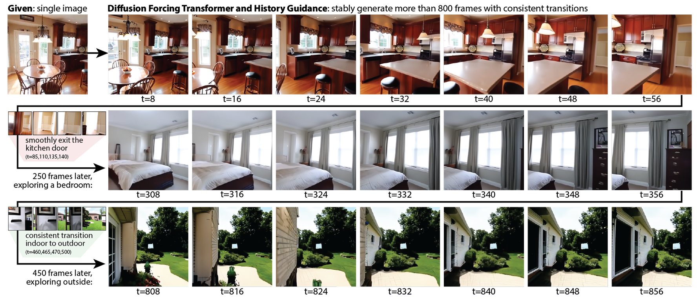

<h1 align="center">Diffusion Forcing Transformer with History Guidance</h1>
<p align="center">
  <p align="center">
    <a href="https://kiwhan.dev/">Kiwhan Song*<sup>1</sup></a>
    ·
    <a href="https://boyuan.space/">Boyuan Chen*<sup>1</sup></a>
    ·
    <a href="https://msimchowitz.github.io/">Max Simchowitz<sup>2</sup></a>
    ·
    <a href="https://yilundu.github.io/">Yilun Du<sup>3</sup></a>
    ·
    <a href="https://groups.csail.mit.edu/locomotion/russt.html">Russ Tedrake<sup>1</sup></a>
    ·
    <a href="https://www.vincentsitzmann.com/">Vincent Sitzmann<sup>1</sup></a>
    <br/>
    *Equal contribution <sup>1</sup>MIT <sup>2</sup>CMU <sup>3</sup>Harvard
  </p>
  <h3 align="center"><a href="https://arxiv.org/abs/2502.06764">Paper</a> | <a href="https://boyuan.space/history-guidance">Website</a> | <a href="https://huggingface.co/spaces/kiwhansong/diffusion-forcing-transformer">HuggingFace Demo</a> | <a href="https://huggingface.co/kiwhansong/DFoT">Pretrained Models</a></h3>
</p>

This is the official repository for the paper [**_History-Guided Video Diffusion_**](https://arxiv.org/abs/2502.06764). We introduce the **Diffusion Forcing Tranformer (DFoT)**, a novel video diffusion model that designed to generate videos conditioned on an arbitrary number of context frames.  Additionally, we present **History Guidance (HG)**, a family of guidance methods uniquely enabled by DFoT. These methods significantly enhance video generation quality, temporal consistency, and motion dynamics, while also unlocking new capabilities such as compositional video generation and the stable rollout of extremely long videos.




## 🔥 News
- **2025-02**: [Diffusion Forcing Transformer](https://github.com/kwsong0113/diffusion-forcing-transformer) is released.

## 🤗 Try generating videos with DFoT in your browser!

We provide an [_interactive_ demo](https://huggingface.co/spaces/kiwhansong/diffusion-forcing-transformer) on HuggingFace Spaces, where you can generate videos with DFoT and History Guidance. On the RealEstate10K dataset, you can generate:
- Any Number of Images → Short 2-second Video
- Single Image → Long 10-second Video
- Single Image → Extremely Long Video (like the teaser above!)

Please check it out and have fun generating videos with DFoT!


## 📖 Detailed Development Wiki
If you just want quickly try our model in python, you can skip this section and proceed to the "Quick Start" section. Otherwise, we provide a comprehensive [wiki](https://github.com/kwsong0113/diffusion-forcing-transformer/wiki) for developers who want to extend the DFoT framework. It offers a detailed guide on thse topics:
- code structure
- command line options
- datasets structure
- checkpointing and loading
- training and evaluating DFoT or baseline models
- every command to reproduce the paper's result

## 🚀 Quick Start

### Setup

#### 1. Create a conda environment and install dependencies:
```bash
conda create python=3.10 -n dfot
conda activate dfot
pip install -r requirements.txt
```
#### 2. Connect to Weights & Biases:
We use Weights & Biases for logging. [Sign up](https://wandb.ai/login?signup=true) if you don't have an account, and *modify `wandb.entity` in `config.yaml` to your user/organization name*.

### Generating Videos with Pretrained Models

Simply run one of the commands below to generate videos with a pretrained DFoT model. They will automatically download a tiny subset of the RealEstate10K dataset and a pretrained DFoT model.


#### 1. Single Image to Long Video (200 Frames, takes ~10 mins):
> **NOTE**: if you encounter CUDA out-of-memory errors (due to limited VRAM), try setting `algorithm.tasks.interpolation.max_batch_size=1`.
```bash
python -m main +name=single_image_to_long dataset=realestate10k_mini algorithm=dfot_video_pose experiment=video_generation @diffusion/continuous load=pretrained:DFoT_RE10K.ckpt 'experiment.tasks=[validation]' experiment.validation.data.shuffle=True dataset.context_length=1 dataset.frame_skip=1 dataset.n_frames=200 algorithm.tasks.prediction.keyframe_density=0.0625 algorithm.tasks.interpolation.max_batch_size=4 experiment.validation.batch_size=1 algorithm.tasks.prediction.history_guidance.name=stabilized_vanilla +algorithm.tasks.prediction.history_guidance.guidance_scale=4.0 +algorithm.tasks.prediction.history_guidance.stabilization_level=0.02  algorithm.tasks.interpolation.history_guidance.name=vanilla +algorithm.tasks.interpolation.history_guidance.guidance_scale=1.5
```

#### 2. Single Image to Short Video (8 Frames, takes <1 min):
```bash
python -m main +name=single_image_to_short dataset=realestate10k_mini algorithm=dfot_video_pose experiment=video_generation @diffusion/continuous load=pretrained:DFoT_RE10K.ckpt 'experiment.tasks=[validation]' experiment.validation.data.shuffle=True dataset.context_length=1 dataset.frame_skip=20 dataset.n_frames=8 experiment.validation.batch_size=1 algorithm.tasks.prediction.history_guidance.name=vanilla +algorithm.tasks.prediction.history_guidance.guidance_scale=4.0
```

#### 3. Interpolating Two Distant Images into Short Video (8 Frames, takes <1 min):
```bash
python -m main +name=two_images_to_interpolated dataset=realestate10k_mini algorithm=dfot_video_pose experiment=video_generation @diffusion/continuous load=pretrained:DFoT_RE10K.ckpt 'experiment.tasks=[validation]' experiment.validation.data.shuffle=True dataset.frame_skip=20 dataset.n_frames=8 experiment.validation.batch_size=1 algorithm.tasks.prediction.enabled=False algorithm.tasks.interpolation.enabled=True algorithm.tasks.interpolation.history_guidance.name=vanilla +algorithm.tasks.interpolation.history_guidance.guidance_scale=4.0
```

#### 4. Generating Videos on Other Datasets
Please refer to our [wiki](https://github.com/kwsong0113/diffusion-forcing-transformer/wiki/Inference-%26-Reproducing-Results) for more details.

### Training

Training a DFoT model requires a large, full dataset. The commands below will automatically download the necessary data, but please note that this process may take a while (~few hours). We also provide specifications for the GPUs required for training. If you are training with fewer GPUs or using a smaller `⁠experiment.training.batch_size`, we recommend proportionally reducing `⁠experiment.training.lr`. You training will produce a wandb link which ends with a wandb run id. To load or resume your trained model, simply append `load={the_wandb_run_id}` and `resume={the_wandb_run_id}` to the training / inferencecommand.

#### 1. RealEstate10K (12 x 80GB VRAM GPUs)

```bash
python -m main +name=RE10k dataset=realestate10k algorithm=dfot_video_pose experiment=video_generation @diffusion/continuous
```

#### 2. Kinetics-600 (12 x 80GB VRAM GPUs)

```bash
python -m main +name=K600 dataset=kinetics_600 algorithm=dfot_video experiment=video_generation @DiT/XL
```

#### 3. Minecraft (12 x 80GB VRAM GPUs)
> **Note**: Minecraft training requires additionally preprocessing videos into latents (see [here](https://github.com/kwsong0113/diffusion-forcing-transformer/wiki/Training#preprocessing-videos-to-latents-using-imagevaes)).

```bash
python -m main +name=MCRAFT dataset=minecraft algorithm=dfot_video experiment=video_generation @diffusion/continuous @DiT/B
```


## 🛠️ Foundation DAgger (Minecraft)
Run DFoT-guided DAgger with Hydra config presets:

```bash
# Collect DFoT + VLM relabeled clips into data/dagger (configurations/experiment/foundation_dagger.yaml)
python -m main experiment=foundation_dagger dataset=dagger algorithm=foundation_dagger

# Optional extra collection pass (override buffer size / reuse BC weights)
python -m main experiment=foundation_dagger dataset=dagger algorithm=foundation_dagger collector.runner.max_episodes=128 collector.runner.policy_checkpoint=/path/to/policy.ckpt

# Train or finetune the BC policy on aggregated tuples only
python -m main experiment=foundation_dagger dataset=dagger algorithm=foundation_dagger tasks=[training]
```

Key knobs:
- `configurations/algorithm/foundation_dagger.yaml` – backbone + three-layer policy head.
- `configurations/world_model/dfot_minecraft.yaml` – DFoT rollout expert (loads `pretrained:DFoT_MCRAFT.ckpt` and the Minecraft ImageVAE).
- `configurations/experiment/foundation_dagger.yaml` – collector prompts, MPC settings, and output buffer paths.

## 📝 Acknowledgements
This repo is using [Boyuan Chen](https://boyuan.space/)'s research template [repo](https://github.com/buoyancy99/research-template). By its license, we just ask you to keep the above sentence and links in `README.md` and the `LICENSE` file to credit the author.


## 📌 Citation

If our work is useful for your research, please consider giving us a star and citing our paper:

```bibtex
@misc{song2025historyguidedvideodiffusion,
  title={History-Guided Video Diffusion}, 
  author={Kiwhan Song and Boyuan Chen and Max Simchowitz and Yilun Du and Russ Tedrake and Vincent Sitzmann},
  year={2025},
  eprint={2502.06764},
  archivePrefix={arXiv},
  primaryClass={cs.LG},
  url={https://arxiv.org/abs/2502.06764}, 
}
```
